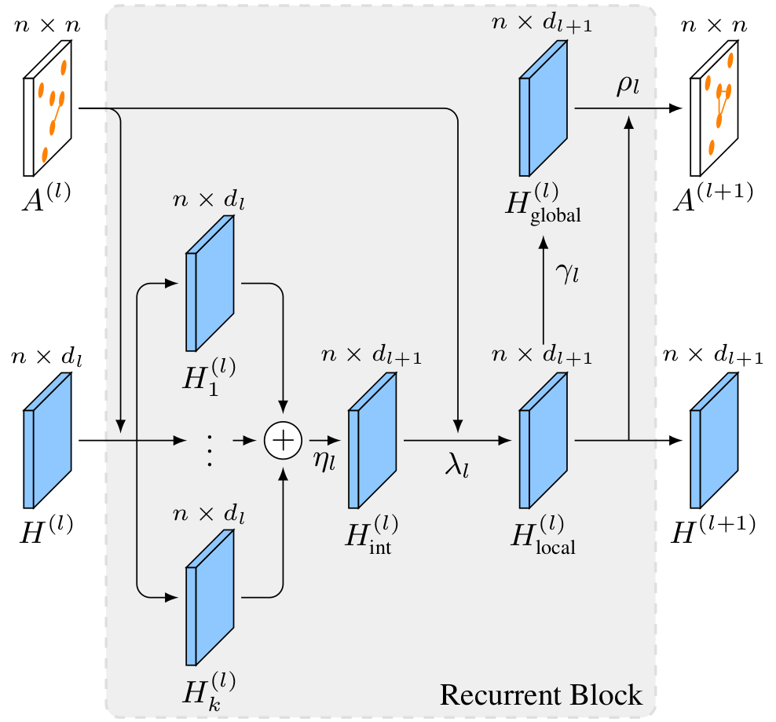

#### Graph Learning Network (GLN)

Created by Darwin Saire and Adín Ramírez Rivera

##### Model

<div align="center"><br>GLN model</div> <br>

We create a set of node embeddings $`\big\{ H^{(l)}_i \big\}_{i=1}^k`$ that are later combined to produce an intermediary representation $`H^{(l)}_{\text{int}}`$. Then, we use the updated node information with the adjacency information to produce a local embedding of the nodes information $`H^{(l)}_{\text{local}}`$ that is also the output $`H^{(l+1)}`$. We also broadcast the information of the local embedding to produce a global embedding $`H^{(l)}_{\text{global}}`$.  We combine the local and global embeddings to predict the next layer adjacency $`A^{(l+1)}`$. We provided a detailed description of the model in our [paper](https://gitlab.com/drafts/graph-nn-inception/tree/icml2019-workshop).

##### Citations

If you are using the code/model/data provided here in a publication, please cite our paper:

```bibtex
@InProceedings{Saire2019,
  author    = {Saire, D. and Ram\'irez Rivera, A.},
  title     = {Graph Learning Network: A Structure Learning Algorithm},
  booktitle = {Workshop on Learning and Reasoning with Graph-Structured Data ({ICMLW} 2019)},
  year      = {2019},
  month     = jun,
  code      = {https://gitlab.com/mipl/graph-learning-network},
}
```

##### Setting up 

- Get this repo, `git clone https://gitlab.com/mipl/graph-learning-network`
- Get a docker env with tensorflow 1.9, sklearn, numpy, opencv3, python3, for example, `docker push darwinsp/tf-opencv-py3:tagname`

##### Run the Model

If you want to run the model with a recurrent block using hidden values of $`32`$ for $`3`$ levels of depth (layers), you must do this.

`gln = GLN(num_nodes, dim_features, [32,32,32,32], '/work/tensorboard_logs/GLN', RNN=True)`

On the other hand, if you want to run the model with a iterative way using hidden values of $`[64, 32, 16, 8]`$ for $`3 `$ levels of depth (layers), you must do this.

`gln = GLN(num_nodes, dim_features, [64,32,16,8], '/work/tensorboard_logs/GLN', RNN=False)`

##### Contact

If you encounter any issue when using our code or model, please let us know.(darwin [dot] saire [at] ic [dot] unicamp [dot] br, adín [at] ic [dot] unicamp [dot] br)